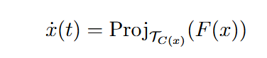

# NonSmoothDynamics

## Projected Dynamical Systems (PDS)

Projected Dynamical Systems (PDS) extend classical dynamical systems by incorporating constraints that keep the system's state within a feasible set. The evolution of the system is described by:

where:

- `x(t)` is the state of the system at time t,
- `F(x)` is a vector field representing the dynamics (e.g., gradient, payoff vector),
- `P_{T_C}` is the projection operator ensuring that `x(t)` remains in the feasible set `C`.

PDS is widely used in optimization, equilibrium modeling, and game theory to describe systems evolving under constraints. Applications include traffic flow, economic equilibria, and constrained optimization problems.

PDS are also highly connected with another nonsmooth dynamical system, the Moreau sweeping process.

This repository provides tools to simulate PDS, including discretized solutions and visualization of trajectories.

## How to Cite

If you use NonSmoothDynamics.jl in your work, please cite using the reference given in [CITATION.cff](https://github.com/tmigot/NonSmoothDynamics.jl/blob/main/CITATION.cff).

## Contributing

If you want to make contributions of any kind, please first that a look into our [contributing guide directly on GitHub](docs/src/90-contributing.md) or the [contributing page on the website](https://tmigot.github.io/NonSmoothDynamics.jl/dev/90-contributing/)

---

### Contributors

<!-- ALL-CONTRIBUTORS-LIST:START - Do not remove or modify this section -->
<!-- prettier-ignore-start -->
<!-- markdownlint-disable -->
<table>
  <tbody>
    <tr>
      <td align="center" valign="top" width="14.28%"><a href="http://tmigot.github.io"> <b>Tangi Migot</b></a> <a href="#infra-tmigot" title="Infrastructure (Hosting, Build-Tools, etc)">🚇</a> <a href="#test-tmigot" title="Tests">⚠️</a> <a href="#code-tmigot" title="Code">💻</a></td>
    </tr>
  </tbody>
</table>

<!-- markdownlint-restore -->
<!-- prettier-ignore-end -->

<!-- ALL-CONTRIBUTORS-LIST:END -->
