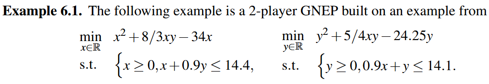

# Projected dynamical system with moving set

It is possible to apply the PDS framework to constraint set that depend on the state x.
One example is the study of nonsmooth dynamics in game theory.

In [Migot, T., & Cojocaru, M. G. (2020). Nonsmooth dynamics of generalized Nash games. J. Nonlinear Var. Anal, 1(4), 27-44.](https://jnva.biemdas.com/issues/JNVA2020-1-4.pdf), the authors study a nonsmooth dynamics whose stable points are generalized Nash equilibrium for noncooperative games.



```@example ex1
using LinearAlgebra, SparseArrays
using NonSmoothDynamics
using Plots
```

First, define constants relative to this example.

```@example ex1
F(x) = -[
    2 * x[1] + 8/3 * x[2] - 34;
    2 * x[2] + 5/4 * x[1] - 24.25
]

function project_moving_set!(sol, y; x = x, kwargs...)
   λ = similar(sol)
   Ain = I
   bin = [14.4 - 0.9 * x[2]; 14.1 - 0.9 * x[1]]
   proj_success = NonSmoothDynamics.numerical_projection!(
   λ, y, I,
   spzeros(0, 2), ones(0),
   Ain, bin,
   zeros(2), Inf * ones(2))
   sol .= λ
   return proj_success
end
```

## Simulate the PDS

Run the reaction with 300 discretization point between 0 and 30.

```@example ex1
x0 = zeros(2)
t0, tf = 0.0, 30.0
x_vals, t_vals, converged = NonSmoothDynamics.projected_dynamical_system(
  x0, F, project_moving_set!,
  t0, tf, 300
)

println("Final State: ", x_vals[:, end], "is close to the known Nash equilibrium [5, 9]")
```

## Visualization

To plot the trajectory:

```@example ex1
using Plots

plot(t_vals, x_vals[1, :], label="x₁ function of time", color=:red, markersize=4)
plot!(t_vals, x_vals[2, :], label="x₂ function of time", color=:green, markersize=4)
```
