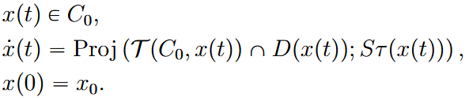
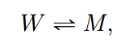

# Projected dynamical system with constraints on derivative

In this tutorial, we present another application of PDS in geochemical system with precipitation-dissolution reactions. Ordinary differential equations are very often used to model aqueous
reactions. However, non smoothness is induced by full dissolution. Moreover, one
reaction can include several minerals and one mineral can participate in several reactions.

The article [Erhel, J., Hamlat, B., & Migot, T. (2024). A projected dynamical system approach to mineral precipitation-dissolution reactions in geochemistry.](https://inria.hal.science/hal-04631094/file/Chapitre3_article.pdf) introduces a PDS model for this type of reaction involving a constraints on the reaction rate.



```@example ex1
using LinearAlgebra, SparseArrays
using NonSmoothDynamics
using Plots
```

The first example is a single reaction with an aqueous species W and a mineral species M



First, define constants relative to this example.

```@example ex1
x0 = [1; 0.5]
n = length(x0) # number of species
m = 2 # number of reactions

# Stoichiometry matrix
S = [-1 1]' # (nxm) matrix
# Matrix of conservation
Q = [1 1]' # (nx(n-m)) matrix

# Reaction rate
tau(x; kr = 1, kp = 2) = kr * x[1] - kp # size m
Stau(x) = (S * tau(x))[:, 1]
```

Then, define the projection operator.

```@example ex1
project_C0!(sol, y; kwargs...) = NonSmoothDynamics.numerical_projection!(
  sol, y, I,
  sparse(Q'), Q' * x0, # satisfy conservation equation
  spzeros(0, n), ones(0),
  zeros(n), Inf * ones(n), # non-negative
)
function project_rate!(sol, y; step_size = step_size, x = x, kwargs...)
   λ = similar(sol)
   proj_success = NonSmoothDynamics.numerical_projection!(
   λ, y, diagm(0 => Stau(x)),
   spzeros(0, 2), ones(0),
   spzeros(0, 2), ones(0),
   zeros(2), ones(2))
   sol .= x + step_size * diagm(0 => Stau(x)) * λ
   return proj_success
end
function project_intersection!(sol, y; step_size = step_size, x = x, kwargs...)
  return NonSmoothDynamics.boyle_dykstra!(
    sol, y,
    [project_C0!, (sol, y; kwargs...) -> project_rate!(sol, y, step_size = step_size, x = x, kwargs...)],
)
end
```

## Simulate the PDS

```@example ex1
x_vals, t_vals, converged = NonSmoothDynamics.projected_dynamical_system(
  x0, x -> Stau(x), project_intersection!,
  0.0, 2.0, 100; # run the reaction with 100 discretization point between 0 and 2.
  project_x0 = false
)

println("Final State: ", x_vals[:, end])
```

## Visualization

To plot the trajectory:

```@example ex1
using Plots

plot(t_vals, x_vals[1, :], label="x₁ function of time", color=:red, markersize=4)
plot!(t_vals, x_vals[2, :], label="x₂ function of time", color=:green, lw=2)
```
